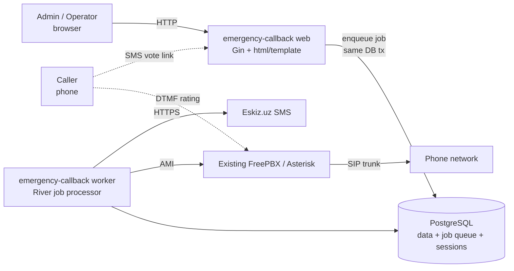

# Emergency Callback

Automated callback & service-rating system for ambulance dispatch.

The system places automated outbound phone calls to people who recently
received ambulance service, asks them to rate the service **1–5** using their
phone keypad (DTMF), optionally transfers them to a live operator, and — when a
call ends without a rating — sends an **SMS** containing a web link where they
can rate instead.

It is a single Go binary backed by one PostgreSQL database, integrating with an
**existing FreePBX/Asterisk** server over AMI for telephony and with
**Eskiz.uz** for SMS.

---

## Architecture at a glance

Key design choices:

- **One database for everything** — application data, the background-job queue
  ([River](https://riverqueue.com/)), and HTTP sessions all live in PostgreSQL.
  **No Redis, no Celery.**
- **One binary, multiple modes** — `web`, `worker`, plus admin utilities
  (`createuser`, `seed`, `migrate`).
- **Integrates with your existing PBX** — it does not replace FreePBX; it drives
  it over the Asterisk Manager Interface (AMI).

---

## Glossary

| Term | Meaning |
|------|---------|
| **Callback** | One outbound call record (`CallbackRequest`). Has a phone number, a team, a status, and timing. |
| **Rating** | A 1–5 score for one callback, collected by phone keypad **or** via the SMS vote page. |
| **Transfer** | Connecting the caller to a live operator (the caller presses `0` or `9`). |
| **Vote / SMS vote** | Fallback rating path: an SMS with a unique link to a web page where the caller rates. |
| **Region → Team (brigada)** | Dispatch hierarchy. A region contains teams; every callback is attached to a team. |
| **Worker** | The background process that actually places calls and sends SMS. |
| **AMI** | Asterisk Manager Interface — the TCP control channel the worker uses to drive Asterisk. |

---

## Where to start

=== "I'm deploying it"

    1. [Prerequisites](getting-started/prerequisites.md)
    2. [Installation](getting-started/installation.md)
    3. [Configuration](getting-started/configuration.md)
    4. [FreePBX Integration](telephony/freepbx-integration.md)
    5. [Running the Services](operations/running-services.md)

=== "I'm operating / using it"

    - [Admin Guide](usage/admin-guide.md) — dashboard, callbacks, ratings, teams
    - [Operator Guide](usage/operator-guide.md)
    - [Voting & SMS](usage/voting-and-sms.md)

=== "I want to change something"

    - [Changing Things (Cookbook)](operations/changing-things.md) — audio, SMS
      text, messages, timeouts, transfer target, country code, …
    - [Audio Prompts](telephony/audio-prompts.md) — replace the voice prompts
    - [Troubleshooting](operations/troubleshooting.md)

=== "I need a fact"

    - [Environment Variables](reference/environment-variables.md)
    - [Database Schema](reference/database-schema.md)
    - [HTTP Routes](reference/http-routes.md)
    - [CLI Commands](reference/cli-commands.md)
    - [Call Status](reference/call-status.md)

---

## Conventions used in this site

!!! note "Notation"
    - `command` in a code block is run in a shell on the server.
    - `<placeholder>` means *replace with your value*.
    - Admonitions like the one below flag the things that bite people.

!!! warning "Telephony gotchas are real"
    Most failures in this system are **Asterisk configuration** problems, not
    application bugs. The [Troubleshooting](operations/troubleshooting.md) page
    and the inline warnings in [FreePBX Integration](telephony/freepbx-integration.md)
    capture every one we have hit in practice.
