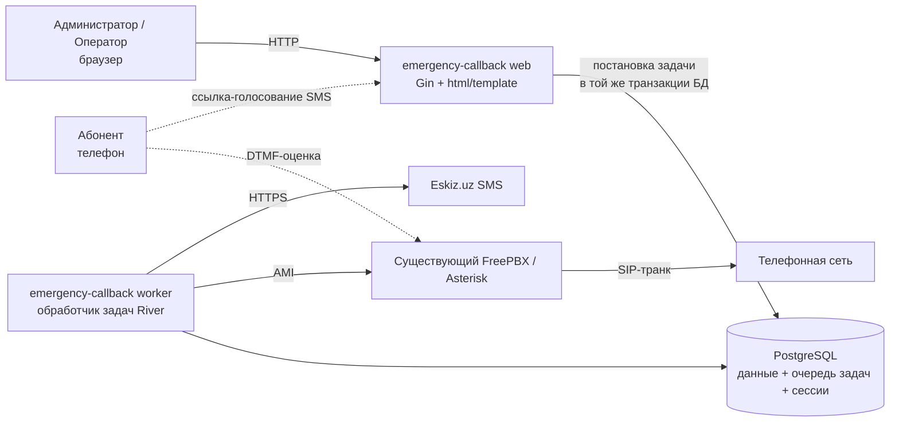

# Emergency Callback

Система автоматического обзвона и оценки качества службы скорой помощи.

Система автоматически звонит людям, недавно получившим помощь скорой, просит их
оценить обслуживание по шкале **1–5** с помощью клавиатуры телефона (DTMF), при
желании переводит их на живого оператора, а если звонок завершился без оценки —
отправляет **SMS** со ссылкой на веб-страницу, где можно поставить оценку.

Это единый Go-бинарник с одной базой данных PostgreSQL, интегрированный с
**существующим сервером FreePBX/Asterisk** для телефонии (через AMI) и с
**Eskiz.uz** для SMS.

---

## Архитектура вкратце

Ключевые решения архитектуры:

- **Одна база данных для всего** — данные приложения, очередь фоновых задач
  ([River](https://riverqueue.com/)) и HTTP-сессии находятся в PostgreSQL.
  **Без Redis, без Celery.**
- **Один бинарник, несколько режимов** — `web`, `worker`, плюс утилиты
  администрирования (`createuser`, `seed`, `migrate`).
- **Интеграция с вашей существующей АТС** — система не заменяет FreePBX, а
  управляет ею через интерфейс Asterisk Manager Interface (AMI).

---

## Глоссарий

| Термин | Значение |
|--------|----------|
| **Callback (вызов)** | Одна запись об исходящем звонке (`CallbackRequest`). Содержит номер телефона, бригаду, статус и тайминги. |
| **Rating (оценка)** | Оценка 1–5 для одного вызова, полученная по телефону **или** через SMS-страницу голосования. |
| **Transfer (перевод)** | Соединение абонента с живым оператором (абонент нажимает `0` или `9`). |
| **Голосование / SMS** | Резервный путь оценки: SMS со ссылкой на веб-страницу с оценкой. |
| **Регион → Бригада** | Иерархия диспетчеризации. Регион содержит бригады; каждый вызов привязан к бригаде. |
| **Worker** | Фоновый процесс, который фактически совершает звонки и отправляет SMS. |
| **AMI** | Asterisk Manager Interface — управляющий TCP-канал, через который worker управляет Asterisk. |

---

## С чего начать

=== "Я разворачиваю систему"

    1. [Требования](getting-started/prerequisites.md)
    2. [Установка](getting-started/installation.md)
    3. [Конфигурация](getting-started/configuration.md)
    4. [Интеграция с FreePBX](telephony/freepbx-integration.md)
    5. [Запуск сервисов](operations/running-services.md)

=== "Я эксплуатирую / использую систему"

    - [Руководство администратора](usage/admin-guide.md) — панель, вызовы, оценки, бригады
    - [Руководство оператора](usage/operator-guide.md)
    - [Голосование и SMS](usage/voting-and-sms.md)

=== "Я хочу что-то изменить"

    - [Изменение настроек (рецепты)](operations/changing-things.md) — аудио, текст
      SMS, сообщения, тайм-ауты, цель перевода, код страны и т. д.
    - [Аудиоподсказки](telephony/audio-prompts.md) — замена голосовых подсказок
    - [Устранение неполадок](operations/troubleshooting.md)

=== "Мне нужен факт"

    - [Переменные окружения](reference/environment-variables.md)
    - [Схема базы данных](reference/database-schema.md)
    - [HTTP-маршруты](reference/http-routes.md)
    - [Команды CLI](reference/cli-commands.md)
    - [Статусы вызова](reference/call-status.md)

---

## Обозначения на этом сайте

!!! note "Нотация"
    - `command` в блоке кода — выполняется в shell на сервере.
    - `<placeholder>` означает *подставьте своё значение*.
    - Блоки-выноски (как ниже) отмечают то, на чём чаще всего спотыкаются.

!!! warning "Проблемы телефонии реальны"
    Большинство сбоев в этой системе — это проблемы **конфигурации Asterisk**, а
    не ошибки приложения. Страница [Устранение неполадок](operations/troubleshooting.md)
    и встроенные предупреждения в [Интеграции с FreePBX](telephony/freepbx-integration.md)
    охватывают все, с чем мы сталкивались на практике.
