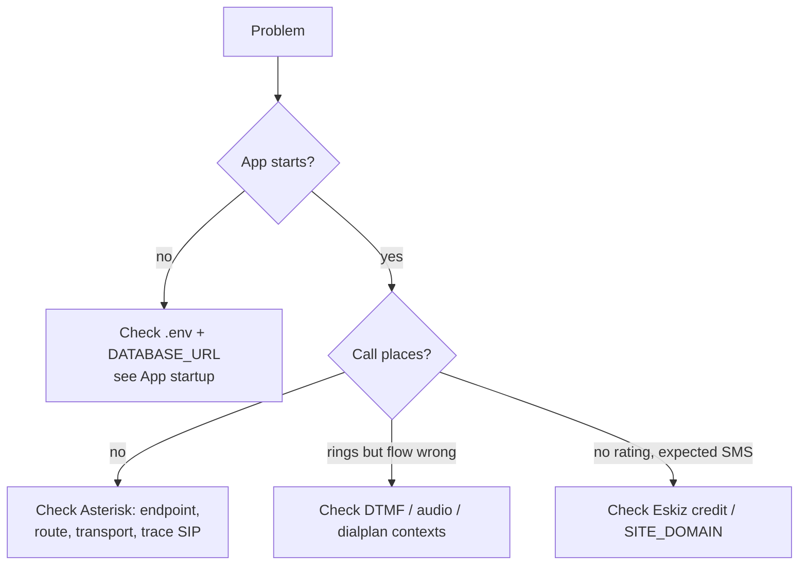

# Troubleshooting

Most problems are **Asterisk configuration**, not application bugs. This page
lists every failure mode seen in practice, the cause, and the fix.

## Quick triage



## App startup

| Symptom | Cause / Fix |
|---------|-------------|
| `required env var ... not set` (panic) | `.env` missing/unreadable, **or** a value contains stray `<`, `>`, or spaces and broke dotenv parsing. Keep values plain `KEY=value` (e.g. `AMI_CALLER_ID=781138081`). |
| `password authentication failed` | Wrong credentials in `DATABASE_URL`, or the DB role/database was never created. |
| `address already in use` | Another process holds `HTTP_ADDR`. Change the port or stop the other process. |
| Login submits but returns to the login screen | Session cookie rejected. Ensure `SESSION_SECRET` is set; behind HTTPS make the cookie `Secure`/`SameSite` consistent with your setup. |
| 500 on a form submit, log shows `gob: type not registered` | Stale binary — current builds register session types. Rebuild and restart. |

## Placing calls

| Symptom | Cause / Fix |
|---------|-------------|
| Call originates then hangs up in **milliseconds** | The outbound `Dial` failed instantly. Almost always trunk/route: no matching outbound route, auth failure, or the endpoint isn't loaded. Trace SIP (below). |
| `endpoint '<trunk>' was not found` | The PJSIP endpoint failed to load. Check `pjsip.conf` for an **invalid option** (e.g. `rxgain`/`txgain` on a PJSIP endpoint) or a **stray non-`key=value` line** that broke parsing for everything after it. Run `asterisk -rx 'pjsip show endpoints'`. |
| `Could not create dialog to invalid URI '<aor>'` | The trunk AOR contact is `Unavailable` because qualify (SIP OPTIONS) goes unanswered. Set `qualify_frequency=0` on that AOR and reload. |
| `Unable to retrieve PJSIP transport 'transport-udp'` / `Address already in use` | Two Asterisk instances (or another SIP app) are fighting over UDP 5060. Stop the extra instance or bind this transport to a free port (e.g. `0.0.0.0:5062`) and restart Asterisk. |
| Worker logs `ami originated` but nothing else | The call reached `from-internal` but no outbound route matched the dialed digits. Build/adjust the Outbound Route around the number in the `ami originated phone=...` log line. |
| `Failed to connect to AMI` / immediate `failed` | Wrong `AMI_HOST`/`AMI_PORT`/credentials, or AMI not enabled. `asterisk -rx 'manager show users'` must list your user. |

## During the call

| Symptom | Cause / Fix |
|---------|-------------|
| No DTMF / rating never captured | AMI user missing **`dtmf` read permission**, or endpoint `dtmf_mode` mismatch. Try `dtmf_mode=auto` (or `rfc4733`) on the endpoint. |
| Thank-you audio cut short, premature hangup | The same keypress arrives on multiple bridge legs; old builds blocked the AMI loop on a sleep and processed the echo as a transfer choice. Current builds **de-duplicate** digits and never block the loop — make sure you run a current build. |
| Audio doesn't play (silence) | The WAV isn't where Asterisk looks, wrong permissions, or wrong format. Confirm `core show settings` sounds dir, `chmod 644`, and WAV PCM 16-bit mono 8 kHz. See [Audio Prompts](../telephony/audio-prompts.md). |
| Redirect fails / call drops at prompt | A dialplan context name doesn't match what the app expects (`ambulance-callback`, `play-audio`, `transfer-to-337`). Don't rename them. |

## SMS

| Symptom | Cause / Fix |
|---------|-------------|
| `Please, fill the balance` | Eskiz account out of credit — top up. Use `ESKIZ_DRY_RUN=true` to test without sending. |
| SMS sent but link is unreachable | `SITE_DOMAIN` wrong or not publicly reachable. Set it to the real external URL. |
| Vote link returns 404 | The `vote_uuid` doesn't exist in the current database (e.g. link generated against a previous DB). |

## Live debugging toolkit

```bash
# Application
journalctl -u emergency-callback-worker -f
journalctl -u emergency-callback-web -f

# Asterisk: trace SIP for the next call
sudo asterisk -rx 'pjsip set logger on'
sudo tail -f /var/log/asterisk/full.log

# Inspect Asterisk state
sudo asterisk -rx 'manager show users'
sudo asterisk -rx 'pjsip show endpoints'
sudo asterisk -rx 'pjsip show transports'
sudo asterisk -rx 'pjsip show registrations'
sudo asterisk -rx 'core show channels'
sudo asterisk -rx 'dialplan show ambulance-callback'

# Database
psql "$DATABASE_URL" -c \
  "SELECT id, phone_number, status, error_message, call_started_at, call_ended_at \
   FROM callbacks_callbackrequest ORDER BY id DESC LIMIT 10;"
```

## Reading a SIP trace

A healthy outbound call:

```
INVITE sip:998XXXXXXXXX@<provider>   →
  401 Unauthorized        (provider challenges; Asterisk re-sends with auth)
  100 Trying
  183 Session Progress    (ringback — phone is ringing)
  200 OK                  (answered)
```

If you see `404`, `403`, `488`, `503`, or `No route to destination`, the trunk
or route is the problem, not the application.
