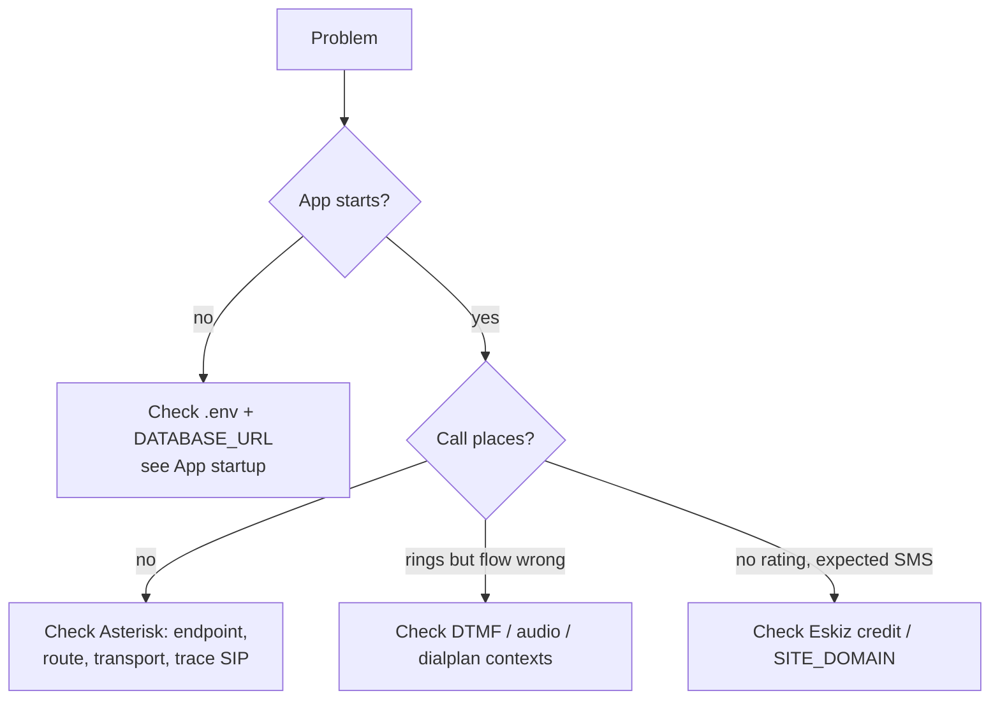

# Устранение неполадок

Большинство проблем — это **конфигурация Asterisk**, а не ошибки приложения. На этой
странице перечислены все режимы отказа, встречавшиеся на практике, их причина и решение.

## Быстрая сортировка



## Запуск приложения

| Симптом | Причина / Решение |
|---------|-------------|
| `required env var ... not set` (panic) | `.env` отсутствует/нечитаем, **или** значение содержит лишние `<`, `>` или пробелы, что сломало разбор dotenv. Держите значения в простом виде `KEY=value` (например, `AMI_CALLER_ID=781138081`). |
| `password authentication failed` | Неверные учётные данные в `DATABASE_URL`, либо роль/база данных так и не были созданы. |
| `address already in use` | Другой процесс удерживает `HTTP_ADDR`. Смените порт или остановите другой процесс. |
| Форма входа отправляется, но возвращает на экран входа | Cookie сессии отклонён. Убедитесь, что задан `SESSION_SECRET`; за HTTPS настройте cookie `Secure`/`SameSite` согласованно с вашей конфигурацией. |
| 500 при отправке формы, в логе `gob: type not registered` | Устаревший бинарник — текущие сборки регистрируют типы сессий. Пересоберите и перезапустите. |

## Совершение звонков

| Симптом | Причина / Решение |
|---------|-------------|
| Звонок инициируется, затем кладётся за **миллисекунды** | Исходящий `Dial` мгновенно завершился неудачей. Почти всегда дело в trunk/маршруте: нет подходящего исходящего маршрута, ошибка аутентификации или endpoint не загружен. Трассируйте SIP (ниже). |
| `endpoint '<trunk>' was not found` | Endpoint PJSIP не загрузился. Проверьте `pjsip.conf` на **недопустимый параметр** (например, `rxgain`/`txgain` на endpoint PJSIP) или **постороннюю строку не в формате `key=value`**, которая сломала разбор всего после неё. Выполните `asterisk -rx 'pjsip show endpoints'`. |
| `Could not create dialog to invalid URI '<aor>'` | Контакт AOR транка находится в состоянии `Unavailable`, потому что qualify (SIP OPTIONS) остаётся без ответа. Установите `qualify_frequency=0` на этом AOR и перезагрузите. |
| `Unable to retrieve PJSIP transport 'transport-udp'` / `Address already in use` | Два экземпляра Asterisk (или другое SIP-приложение) борются за UDP 5060. Остановите лишний экземпляр или привяжите этот transport к свободному порту (например, `0.0.0.0:5062`) и перезапустите Asterisk. |
| Worker пишет в лог `ami originated`, но больше ничего | Звонок дошёл до `from-internal`, но ни один исходящий маршрут не совпал с набранными цифрами. Создайте/скорректируйте Outbound Route вокруг номера из строки лога `ami originated phone=...`. |
| `Failed to connect to AMI` / немедленный `failed` | Неверные `AMI_HOST`/`AMI_PORT`/учётные данные, либо AMI не включён. `asterisk -rx 'manager show users'` должен показывать вашего пользователя. |

## Во время звонка

| Симптом | Причина / Решение |
|---------|-------------|
| Нет DTMF / оценка никогда не фиксируется | У пользователя AMI отсутствует **право чтения `dtmf`**, либо несоответствие `dtmf_mode` на endpoint. Попробуйте `dtmf_mode=auto` (или `rfc4733`) на endpoint. |
| Благодарственное аудио обрывается, преждевременный отбой | Одно и то же нажатие клавиши приходит на несколько ветвей моста; старые сборки блокировали цикл AMI на sleep и обрабатывали эхо как выбор перевода. Текущие сборки **дедуплицируют** цифры и никогда не блокируют цикл — убедитесь, что вы используете актуальную сборку. |
| Аудио не воспроизводится (тишина) | WAV не там, где его ищет Asterisk, неверные права или неверный формат. Проверьте каталог звуков в `core show settings`, `chmod 644` и WAV PCM 16-бит моно 8 кГц. См. [Аудиоподсказки](../telephony/audio-prompts.md). |
| Redirect не срабатывает / звонок обрывается на подсказке | Имя контекста dialplan не совпадает с тем, что ожидает приложение (`ambulance-callback`, `play-audio`, `transfer-to-337`). Не переименовывайте их. |

## SMS

| Симптом | Причина / Решение |
|---------|-------------|
| `Please, fill the balance` | На счету Eskiz закончились средства — пополните. Используйте `ESKIZ_DRY_RUN=true` для тестирования без отправки. |
| SMS отправлено, но ссылка недоступна | `SITE_DOMAIN` неверен или недоступен публично. Установите его в реальный внешний URL. |
| Ссылка для голосования возвращает 404 | `vote_uuid` отсутствует в текущей базе данных (например, ссылка сгенерирована для предыдущей БД). |

## Инструментарий отладки в реальном времени

```bash
# Application
journalctl -u emergency-callback-worker -f
journalctl -u emergency-callback-web -f

# Asterisk: trace SIP for the next call
sudo asterisk -rx 'pjsip set logger on'
sudo tail -f /var/log/asterisk/full.log

# Inspect Asterisk state
sudo asterisk -rx 'manager show users'
sudo asterisk -rx 'pjsip show endpoints'
sudo asterisk -rx 'pjsip show transports'
sudo asterisk -rx 'pjsip show registrations'
sudo asterisk -rx 'core show channels'
sudo asterisk -rx 'dialplan show ambulance-callback'

# Database
psql "$DATABASE_URL" -c \
  "SELECT id, phone_number, status, error_message, call_started_at, call_ended_at \
   FROM callbacks_callbackrequest ORDER BY id DESC LIMIT 10;"
```

## Чтение трассировки SIP

Здоровый исходящий звонок:

```
INVITE sip:998XXXXXXXXX@<provider>   →
  401 Unauthorized        (provider challenges; Asterisk re-sends with auth)
  100 Trying
  183 Session Progress    (ringback — phone is ringing)
  200 OK                  (answered)
```

Если вы видите `404`, `403`, `488`, `503` или `No route to destination`, проблема в trunk
или маршруте, а не в приложении.
