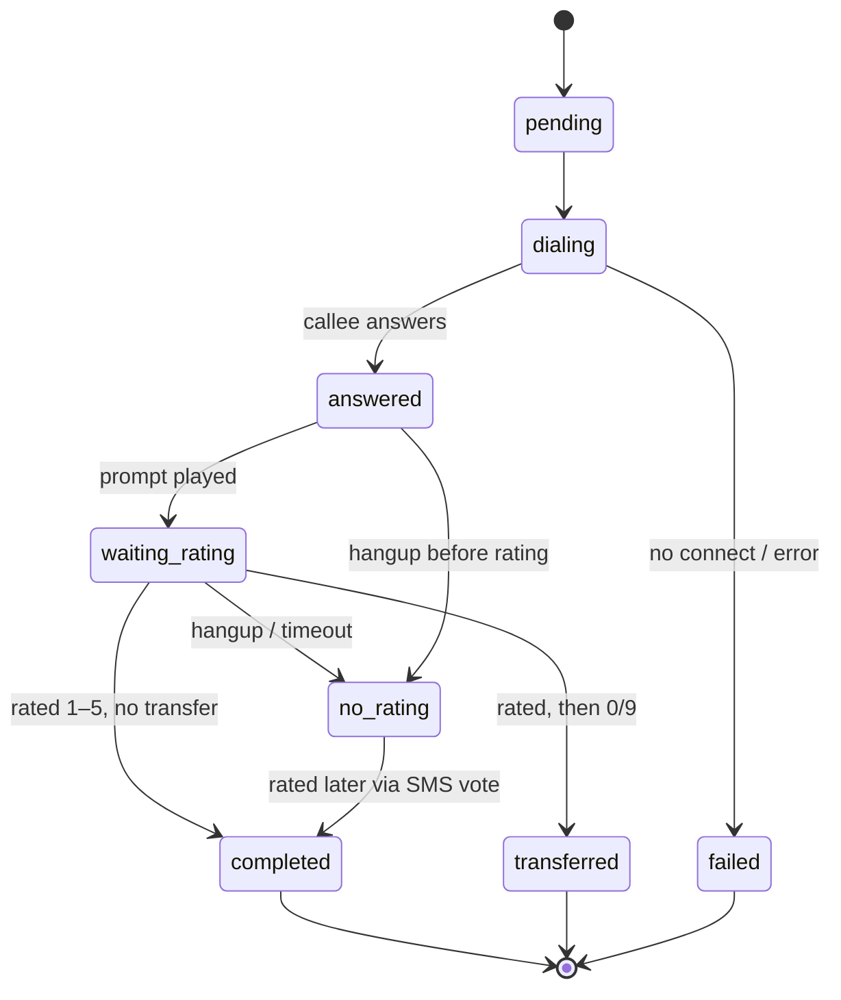

# Call Status

The `status` column on `callbacks_callbackrequest` tracks where a call is in its
lifecycle. Values are stored as lowercase strings.

## Values

| Status | Meaning | Terminal? |
|--------|---------|-----------|
| `pending` | Created, not yet picked up by the worker. | no |
| `dialing` | Worker is originating the call. | no |
| `connecting` | Call is connecting. | no |
| `answered` | Callee answered; prompts in progress. | no |
| `waiting_rating` | Waiting for the caller to press 1–5 (phone or pending SMS vote). | no |
| `waiting_additional` | Waiting for additional input (reserved). | no |
| `transferring` | Being transferred to an operator. | no |
| `completed` | Finished successfully (rating collected, or vote submitted via SMS). | yes |
| `transferred` | Caller was transferred to an operator. | yes |
| `no_rating` | Ended without a rating (triggers SMS fallback). | yes |
| `failed` | Could not connect / errored. | yes |

## Typical transitions

## How statuses are set

- The **worker** sets `dialing` at pickup and the terminal status
  (`completed` / `transferred` / `no_rating` / `failed`) when the call ends,
  based on what happened on the call.
- The **SMS vote page** sets `completed` (with `voted_via_sms = true`) when a
  caller rates via the web link.
- The periodic **`CleanupStaleCalls`** job moves anything stuck in a
  non-terminal status for >30 minutes to `failed` (if it never connected) or
  `no_rating` (if it connected but got no rating), and `transferred` if it was
  mid-transfer — sending SMS where appropriate.

## Where it shows up

- **Callbacks list / detail** render the status as a colored badge.
- **Dashboard** aggregates: completed (incl. transferred), failed, no-rating,
  pending; and computes success/failure rates.

Color mapping (UI): `completed`/`transferred` → green, `failed` → red,
`pending`/`no_rating` → amber, in-progress states → blue.
