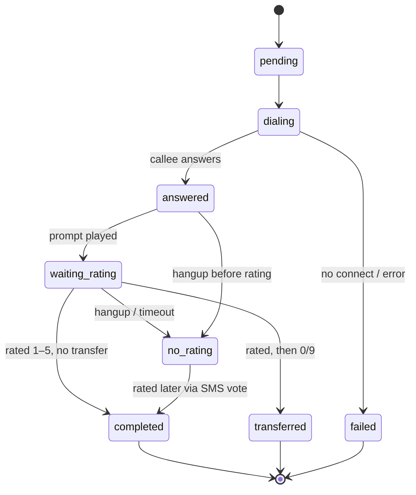

# Статус звонка

Столбец `status` в таблице `callbacks_callbackrequest` отслеживает, на каком этапе
жизненного цикла находится звонок. Значения хранятся в виде строк в нижнем регистре.

## Значения

| Статус | Значение | Терминальный? |
|--------|---------|-----------|
| `pending` | Создан, ещё не подхвачен worker. | нет |
| `dialing` | Worker инициирует звонок. | нет |
| `connecting` | Звонок устанавливается. | нет |
| `answered` | Абонент ответил; воспроизводятся подсказки. | нет |
| `waiting_rating` | Ожидается, что абонент нажмёт 1–5 (по телефону или ожидающее голосование по SMS). | нет |
| `waiting_additional` | Ожидается дополнительный ввод (зарезервировано). | нет |
| `transferring` | Выполняется перевод на оператора. | нет |
| `completed` | Успешно завершён (оценка получена либо голос отправлен через SMS). | да |
| `transferred` | Абонент был переведён на оператора. | да |
| `no_rating` | Завершён без оценки (запускает запасной вариант с SMS). | да |
| `failed` | Не удалось соединиться / возникла ошибка. | да |

## Типичные переходы

## Как устанавливаются статусы

- **worker** устанавливает `dialing` при подхвате задачи и терминальный статус
  (`completed` / `transferred` / `no_rating` / `failed`) по завершении звонка,
  в зависимости от того, что произошло в ходе звонка.
- **Страница голосования по SMS** устанавливает `completed` (с `voted_via_sms = true`),
  когда абонент ставит оценку через веб-ссылку.
- Периодическая задача **`CleanupStaleCalls`** переводит всё, что застряло в
  нетерминальном статусе более чем на 30 минут, в `failed` (если соединение так и не
  было установлено) или `no_rating` (если соединение было установлено, но оценка не
  получена), и в `transferred`, если перевод выполнялся в момент сбоя — отправляя
  SMS там, где это уместно.

## Где он отображается

- **Список / карточка обратных звонков** отображают статус в виде цветного бейджа.
- **Дашборд** агрегирует: завершённые (включая переведённые), неудачные, без оценки,
  ожидающие; и вычисляет доли успешных/неудачных звонков.

Сопоставление цветов (UI): `completed`/`transferred` → зелёный, `failed` → красный,
`pending`/`no_rating` → янтарный, состояния в процессе → синий.
