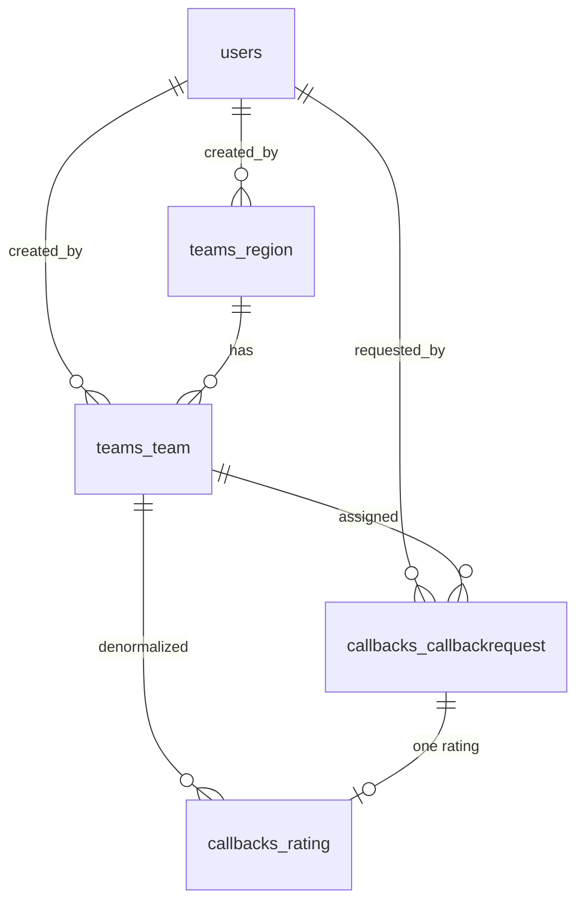

# Database Schema

The schema is created by goose migrations in `migrations/` and mirrors the
original Django models 1:1. It uses the `pgcrypto` extension for
`gen_random_uuid()` (created by the first migration).

## Entity relationships

## `users`

Custom user (Django `AbstractUser` equivalent). Passwords are **bcrypt** hashes.

| Column | Type | Notes |
|--------|------|-------|
| `id` | BIGSERIAL PK | |
| `username` | VARCHAR(150) UNIQUE | |
| `password` | VARCHAR(255) | bcrypt hash |
| `email`, `first_name`, `last_name` | VARCHAR | default `''` |
| `is_active`, `is_staff`, `is_superuser` | BOOLEAN | |
| `role` | VARCHAR(20) | `admin` or `operator` (CHECK) |
| `date_joined` | TIMESTAMPTZ | default now |
| `last_login` | TIMESTAMPTZ NULL | |

## `teams_region`

| Column | Type | Notes |
|--------|------|-------|
| `id` | BIGSERIAL PK | |
| `name` | VARCHAR(100) UNIQUE | |
| `code` | VARCHAR(20) UNIQUE | |
| `description` | TEXT | default `''` |
| `is_active` | BOOLEAN | default true |
| `created_at` | TIMESTAMPTZ | |
| `created_by_id` | BIGINT FK → users | ON DELETE CASCADE |

## `teams_team`

| Column | Type | Notes |
|--------|------|-------|
| `id` | BIGSERIAL PK | |
| `name` | VARCHAR(100) | |
| `description` | TEXT | default `''` |
| `region_id` | BIGINT FK → teams_region | ON DELETE CASCADE |
| `is_active` | BOOLEAN | default true |
| `created_at` | TIMESTAMPTZ | |
| `created_by_id` | BIGINT FK → users | |
| | | UNIQUE(`name`, `region_id`) |

## `callbacks_callbackrequest`

The core call record.

| Column | Type | Notes |
|--------|------|-------|
| `id` | BIGSERIAL PK | |
| `phone_number` | VARCHAR(20) | |
| `team_id` | BIGINT FK → teams_team | |
| `status` | VARCHAR(20) | see [Call Status](call-status.md), default `pending` |
| `call_id` | UUID UNIQUE | default `gen_random_uuid()` |
| `uniqueid` | VARCHAR(100) NULL | Asterisk uniqueid |
| `channel` | VARCHAR(100) NULL | Asterisk channel |
| `created_at` | TIMESTAMPTZ | |
| `call_started_at` | TIMESTAMPTZ NULL | |
| `call_ended_at` | TIMESTAMPTZ NULL | |
| `call_duration` | INTEGER NULL | seconds |
| `error_message` | TEXT NULL | |
| `transferred` | BOOLEAN | default false |
| `additional_questions` | BOOLEAN NULL | |
| `requested_by_id` | BIGINT FK → users | |
| `vote_uuid` | UUID UNIQUE | default `gen_random_uuid()` — used in SMS link |
| `sms_sent` | BOOLEAN | default false |
| `sms_sent_at` | TIMESTAMPTZ NULL | |
| `voted_via_sms` | BOOLEAN | default false |

Indexes: `status`, `created_at`, `phone_number`, `team_id`, `vote_uuid`.

## `callbacks_rating`

One rating per callback (one-to-one). Some columns are denormalized for
reporting.

| Column | Type | Notes |
|--------|------|-------|
| `id` | BIGSERIAL PK | |
| `callback_request_id` | BIGINT UNIQUE FK → callbackrequest | ON DELETE CASCADE (enforces one-to-one) |
| `rating` | INTEGER | CHECK 1–5 |
| `comment` | TEXT NULL | |
| `timestamp` | TIMESTAMPTZ | |
| `phone_number` | VARCHAR(20) | denormalized |
| `team_id` | BIGINT FK → teams_team | denormalized |
| `date` | DATE | default current date |

Indexes: `rating`, `date`, `team_id`, `timestamp`.

## `sessions`

HTTP session store (managed by `scs`).

| Column | Type |
|--------|------|
| `token` | TEXT PK |
| `data` | BYTEA |
| `expiry` | TIMESTAMPTZ (indexed) |

## River tables

The job queue creates its own tables (e.g. `river_job`, `river_leader`, …) via
`river migrate-up`. They live in their own namespace and are managed by River —
do not modify them by hand.

## Migrations

| File | Creates |
|------|---------|
| `0001_extensions.sql` | `pgcrypto` extension |
| `0002_users.sql` | `users` |
| `0003_regions.sql` | `teams_region` |
| `0004_teams.sql` | `teams_team` |
| `0005_callbacks.sql` | `callbacks_callbackrequest` |
| `0006_ratings.sql` | `callbacks_rating` |
| `0007_scs_sessions.sql` | `sessions` |

Apply with `./emergency-callback migrate up`; check with `migrate status`.
