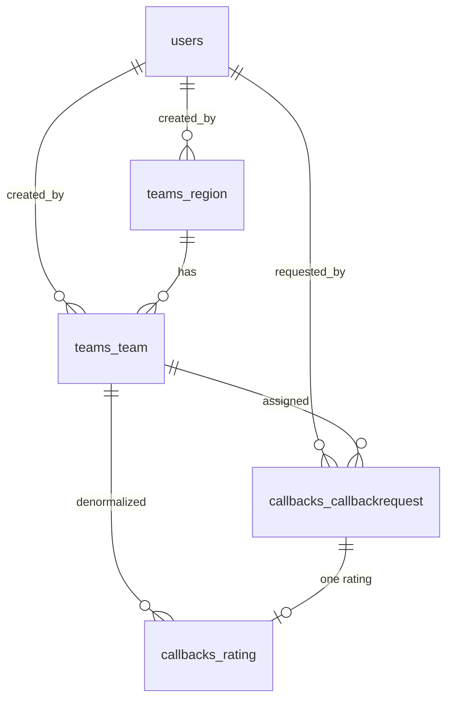

# Схема базы данных

Схема создаётся миграциями goose в `migrations/` и зеркалит
исходные модели Django один к одному. Она использует расширение `pgcrypto` для
`gen_random_uuid()` (создаётся первой миграцией).

## Связи сущностей

## `users`

Кастомный пользователь (эквивалент Django `AbstractUser`). Пароли — хеши **bcrypt**.

| Столбец | Тип | Примечания |
|--------|------|-------|
| `id` | BIGSERIAL PK | |
| `username` | VARCHAR(150) UNIQUE | |
| `password` | VARCHAR(255) | хеш bcrypt |
| `email`, `first_name`, `last_name` | VARCHAR | по умолчанию `''` |
| `is_active`, `is_staff`, `is_superuser` | BOOLEAN | |
| `role` | VARCHAR(20) | `admin` или `operator` (CHECK) |
| `date_joined` | TIMESTAMPTZ | по умолчанию now |
| `last_login` | TIMESTAMPTZ NULL | |

## `teams_region`

| Столбец | Тип | Примечания |
|--------|------|-------|
| `id` | BIGSERIAL PK | |
| `name` | VARCHAR(100) UNIQUE | |
| `code` | VARCHAR(20) UNIQUE | |
| `description` | TEXT | по умолчанию `''` |
| `is_active` | BOOLEAN | по умолчанию true |
| `created_at` | TIMESTAMPTZ | |
| `created_by_id` | BIGINT FK → users | ON DELETE CASCADE |

## `teams_team`

| Столбец | Тип | Примечания |
|--------|------|-------|
| `id` | BIGSERIAL PK | |
| `name` | VARCHAR(100) | |
| `description` | TEXT | по умолчанию `''` |
| `region_id` | BIGINT FK → teams_region | ON DELETE CASCADE |
| `is_active` | BOOLEAN | по умолчанию true |
| `created_at` | TIMESTAMPTZ | |
| `created_by_id` | BIGINT FK → users | |
| | | UNIQUE(`name`, `region_id`) |

## `callbacks_callbackrequest`

Основная запись о звонке.

| Столбец | Тип | Примечания |
|--------|------|-------|
| `id` | BIGSERIAL PK | |
| `phone_number` | VARCHAR(20) | |
| `team_id` | BIGINT FK → teams_team | |
| `status` | VARCHAR(20) | см. [Статусы звонков](call-status.md), по умолчанию `pending` |
| `call_id` | UUID UNIQUE | по умолчанию `gen_random_uuid()` |
| `uniqueid` | VARCHAR(100) NULL | uniqueid в Asterisk |
| `channel` | VARCHAR(100) NULL | канал Asterisk |
| `created_at` | TIMESTAMPTZ | |
| `call_started_at` | TIMESTAMPTZ NULL | |
| `call_ended_at` | TIMESTAMPTZ NULL | |
| `call_duration` | INTEGER NULL | секунды |
| `error_message` | TEXT NULL | |
| `transferred` | BOOLEAN | по умолчанию false |
| `additional_questions` | BOOLEAN NULL | |
| `requested_by_id` | BIGINT FK → users | |
| `vote_uuid` | UUID UNIQUE | по умолчанию `gen_random_uuid()` — используется в ссылке SMS |
| `sms_sent` | BOOLEAN | по умолчанию false |
| `sms_sent_at` | TIMESTAMPTZ NULL | |
| `voted_via_sms` | BOOLEAN | по умолчанию false |

Индексы: `status`, `created_at`, `phone_number`, `team_id`, `vote_uuid`.

## `callbacks_rating`

Одна оценка на один обратный звонок (один к одному). Некоторые столбцы денормализованы для
отчётности.

| Столбец | Тип | Примечания |
|--------|------|-------|
| `id` | BIGSERIAL PK | |
| `callback_request_id` | BIGINT UNIQUE FK → callbackrequest | ON DELETE CASCADE (обеспечивает связь один к одному) |
| `rating` | INTEGER | CHECK 1–5 |
| `comment` | TEXT NULL | |
| `timestamp` | TIMESTAMPTZ | |
| `phone_number` | VARCHAR(20) | денормализовано |
| `team_id` | BIGINT FK → teams_team | денормализовано |
| `date` | DATE | по умолчанию текущая дата |

Индексы: `rating`, `date`, `team_id`, `timestamp`.

## `sessions`

Хранилище HTTP-сессий (управляется `scs`).

| Столбец | Тип |
|--------|------|
| `token` | TEXT PK |
| `data` | BYTEA |
| `expiry` | TIMESTAMPTZ (с индексом) |

## Таблицы River

Очередь задач создаёт собственные таблицы (например, `river_job`, `river_leader`, …) через
`river migrate-up`. Они находятся в собственном пространстве имён и управляются River —
не изменяйте их вручную.

## Миграции

| Файл | Создаёт |
|------|---------|
| `0001_extensions.sql` | расширение `pgcrypto` |
| `0002_users.sql` | `users` |
| `0003_regions.sql` | `teams_region` |
| `0004_teams.sql` | `teams_team` |
| `0005_callbacks.sql` | `callbacks_callbackrequest` |
| `0006_ratings.sql` | `callbacks_rating` |
| `0007_scs_sessions.sql` | `sessions` |

Применяйте с помощью `./emergency-callback migrate up`; проверяйте с помощью `migrate status`.
