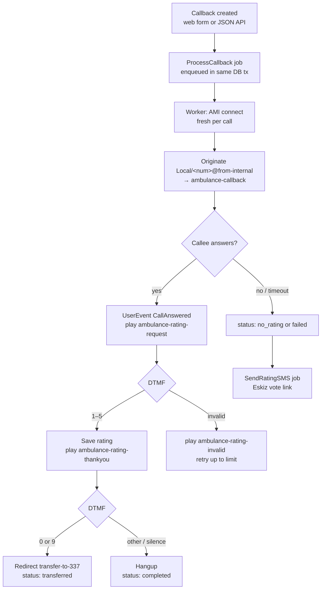

# Call Flow

End-to-end life of one callback, from creation to a final status.

## High-level sequence



## Step by step

1. **Creation.** An admin/operator submits the create form, or a system POSTs
   `/api/create/`. A `CallbackRequest` row is inserted **and** a
   `ProcessCallback` job is enqueued **in the same database transaction** — if
   the insert rolls back, no orphan job runs.

2. **Pickup.** The worker dequeues the job and opens a **fresh AMI connection**
   for this call (no shared/pooled connection — deliberate, keeps calls
   isolated).

3. **Originate.** The worker sends `Originate` for
   `Local/<local-number>@from-internal/n` into context `ambulance-callback`,
   passing `CALL_ID`, `PHONE_NUMBER`, `BRIGADE_ID`, `CALLBACK_REQUEST_ID`. The
   `998` country code is stripped before dialing; FreePBX's outbound route sends
   it to the trunk.

4. **Ring & answer.** The trunk rings the phone. On answer, the
   `ambulance-callback` leg fires `UserEvent: CallAnswered`. The worker records
   the answer time, captures the channel, and redirects it to
   `play-audio/ambulance-rating-request`.

5. **Rating.** The caller presses a key:
    - **1–5:** the rating is saved to the DB immediately, then
      `ambulance-rating-thankyou` plays. State advances to "waiting for transfer
      decision".
    - **Invalid key:** `ambulance-rating-invalid` plays and the prompt repeats,
      up to `AMI_RATING_RETRY_LIMIT` times, then the call ends.

6. **Transfer decision.** After the thank-you:
    - **0 or 9:** the call is redirected to `transfer-to-337` (operator). Final
      status `transferred`.
    - **Any other key or silence:** the call hangs up. Final status `completed`.

7. **No-rating fallback.** If the call ended with **no** rating (no answer,
   hangup before rating, or timeout), the worker enqueues a `SendRatingSMS` job
   that texts the caller a link: `<SITE_DOMAIN>/vote/<uuid>`. They can rate on
   the web instead. See [Voting & SMS](../usage/voting-and-sms.md).

8. **Cleanup.** A periodic job (`CleanupStaleCalls`, every 15 minutes) finalizes
   any call stuck in an intermediate state for over 30 minutes and triggers SMS
   where appropriate.

## What a healthy call looks like (worker log)

```
process_callback start          callback_id=42
ami connected                   host=127.0.0.1
ami originated                  phone=901234567
ami call answered               channel=Local/901234567@from-internal-...;1
playing audio                   audio=rating_request
ami dtmf                        digit=3   channel=PJSIP/<trunk>-...
rating saved                    rating=3
playing audio                   audio=rating_thankyou
dtmf duplicate ignored          digit=3                 # echo from the other leg
ami dtmf                        digit=0
transferring
ami hangup
process_callback done           id=42 status=transferred
```

## DTMF handling notes

- The **same physical keypress** is often delivered on more than one leg of the
  Local-channel + trunk bridge (e.g. the trunk PJSIP leg **and** the Local `;1`
  leg), arriving milliseconds to a few seconds apart. The app **de-duplicates**
  identical digits within a short window, so one press is processed once.
- DTMF events are matched to the call by `Uniqueid`, `Linkedid`, channel name,
  or the phone number embedded in the channel — whichever is present — which is
  why digits are caught even when they surface on the trunk leg.
- The app never blocks the AMI event loop on sleeps, so hangups and digits are
  processed promptly (this is why thank-you audio plays to completion).

## SIP-level view (for trunk debugging)

A successful outbound INVITE through the trunk looks like:

```
INVITE sip:998XXXXXXXXX@<provider>   →
  100 Trying
  183 Session Progress      (ringback)
  200 OK                    (answered)
```

Enable the trace with `asterisk -rx 'pjsip set logger on'` and read
`/var/log/asterisk/full.log`. See
[Troubleshooting](../operations/troubleshooting.md).
