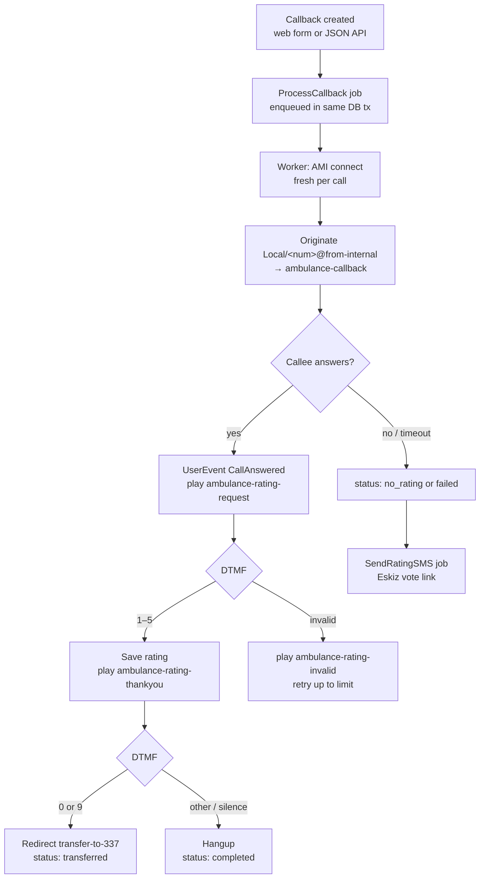

# Поток вызова

Полный жизненный цикл одного обратного вызова — от создания до финального статуса.

## Последовательность на верхнем уровне



## Шаг за шагом

1. **Создание.** Администратор/оператор отправляет форму создания, либо система
   делает POST-запрос на `/api/create/`. Строка `CallbackRequest` вставляется
   **и** задание `ProcessCallback` ставится в очередь **в рамках одной и той же
   транзакции базы данных** — если вставка откатывается, ни одно осиротевшее
   задание не выполняется.

2. **Подхват.** Worker извлекает задание из очереди и открывает **свежее
   AMI-соединение** для этого вызова (без общего/пулового соединения — это
   сделано намеренно, чтобы вызовы оставались изолированными).

3. **Originate.** Worker отправляет `Originate` для
   `Local/<local-number>@from-internal/n` в контекст `ambulance-callback`,
   передавая `CALL_ID`, `PHONE_NUMBER`, `BRIGADE_ID`, `CALLBACK_REQUEST_ID`. Код
   страны `998` отсекается перед набором; исходящий маршрут FreePBX отправляет
   вызов в trunk.

4. **Гудки и ответ.** Trunk дозванивается до телефона. При ответе плечо
   `ambulance-callback` генерирует `UserEvent: CallAnswered`. Worker фиксирует
   время ответа, захватывает канал и перенаправляет его в
   `play-audio/ambulance-rating-request`.

5. **Оценка.** Абонент нажимает клавишу:
    - **1–5:** оценка немедленно сохраняется в БД, затем проигрывается
      `ambulance-rating-thankyou`. Состояние переходит к «ожиданию решения о
      переводе».
    - **Недопустимая клавиша:** проигрывается `ambulance-rating-invalid`, и
      подсказка повторяется до `AMI_RATING_RETRY_LIMIT` раз, после чего вызов
      завершается.

6. **Решение о переводе.** После благодарности:
    - **0 или 9:** вызов перенаправляется в `transfer-to-337` (оператор).
      Финальный статус `transferred`.
    - **Любая другая клавиша или тишина:** вызов завершается. Финальный статус
      `completed`.

7. **Резервный вариант без оценки.** Если вызов завершился **без** оценки (нет
   ответа, отбой до оценки или таймаут), worker ставит в очередь задание
   `SendRatingSMS`, которое отправляет абоненту ссылку:
   `<SITE_DOMAIN>/vote/<uuid>`. Вместо этого он может поставить оценку через веб.
   См. [Голосование и SMS](../usage/voting-and-sms.md).

8. **Очистка.** Периодическое задание (`CleanupStaleCalls`, каждые 15 минут)
   финализирует любой вызов, застрявший в промежуточном состоянии более 30 минут,
   и при необходимости запускает SMS.

## Как выглядит исправный вызов (лог worker)

```
process_callback start          callback_id=42
ami connected                   host=127.0.0.1
ami originated                  phone=901234567
ami call answered               channel=Local/901234567@from-internal-...;1
playing audio                   audio=rating_request
ami dtmf                        digit=3   channel=PJSIP/<trunk>-...
rating saved                    rating=3
playing audio                   audio=rating_thankyou
dtmf duplicate ignored          digit=3                 # echo from the other leg
ami dtmf                        digit=0
transferring
ami hangup
process_callback done           id=42 status=transferred
```

## Замечания по обработке DTMF

- **Одно и то же физическое нажатие клавиши** часто доставляется по нескольким
  плечам моста Local-канал + trunk (например, по PJSIP-плечу trunk **и** по
  плечу Local `;1`), приходя с разницей от миллисекунд до нескольких секунд.
  Приложение **дедуплицирует** одинаковые цифры в пределах короткого окна,
  поэтому одно нажатие обрабатывается один раз.
- События DTMF сопоставляются с вызовом по `Uniqueid`, `Linkedid`, имени канала
  или номеру телефона, встроенному в канал — по тому из них, что присутствует, —
  именно поэтому цифры улавливаются даже тогда, когда они всплывают на плече
  trunk.
- Приложение никогда не блокирует цикл событий AMI на ожиданиях, поэтому отбои и
  цифры обрабатываются оперативно (именно поэтому аудио с благодарностью
  проигрывается до конца).

## Взгляд на уровне SIP (для отладки trunk)

Успешный исходящий INVITE через trunk выглядит так:

```
INVITE sip:998XXXXXXXXX@<provider>   →
  100 Trying
  183 Session Progress      (ringback)
  200 OK                    (answered)
```

Включите трассировку командой `asterisk -rx 'pjsip set logger on'` и читайте
`/var/log/asterisk/full.log`. См.
[Устранение неполадок](../operations/troubleshooting.md).
