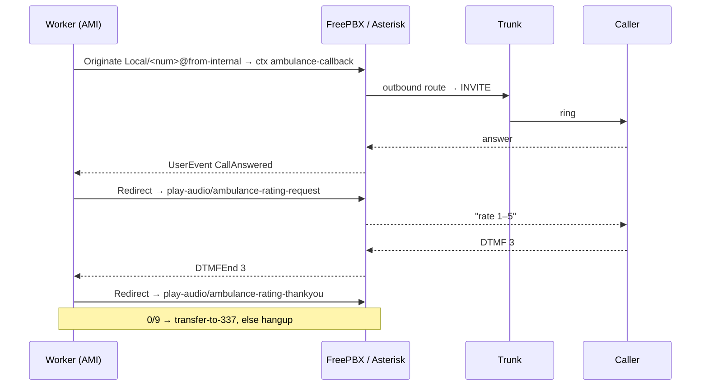

# FreePBX Integration

This is the **primary** telephony setup. The application does **not** replace
your PBX — it drives your existing FreePBX/Asterisk over AMI. You will:

1. Create an **AMI user** for the app (GUI **or** terminal).
2. Add **3 custom dialplan contexts** that the app controls.
3. Make sure outbound calls **route to your existing trunk**.
4. Install the **6 audio prompts**.
5. Point the app's `.env` at the PBX.



!!! info "Where does the worker run?"
    The simplest, most reliable topology is to run `emergency-callback worker`
    **on the FreePBX host itself**, so AMI stays on `127.0.0.1:5038`. If it runs
    elsewhere, open AMI to that host and set `AMI_HOST` accordingly (and firewall
    it tightly — AMI is powerful).

---

## Step 1 — Create the AMI user

The app authenticates to AMI with `AMI_USERNAME` / `AMI_SECRET` from `.env`.
Use **either** the GUI or the terminal.

=== "FreePBX GUI"

    1. Log in to the FreePBX admin UI.
    2. Go to **Settings → Asterisk Manager Users**.
    3. Click **Add Manager** and set:
        - **Manager name:** `ecb`
        - **Manager secret:** a strong secret (this becomes `AMI_SECRET`)
        - **Deny:** `0.0.0.0/0.0.0.0`
        - **Permit:** `127.0.0.1/255.255.255.255` (or the worker host)
        - **Read permissions:** tick at least `system, call, log, verbose,
          agent, user, config, dtmf, reporting, cdr, dialplan, originate`
        - **Write permissions:** tick at least `system, call, agent, user,
          config, command, reporting, originate, message`
    4. **Submit**, then **Apply Config** (this writes the user and reloads).

    !!! danger "The `dtmf` read permission is mandatory"
        Without `dtmf` read permission the app never receives keypad digits, so
        ratings can never be collected over the phone.

=== "Terminal"

    FreePBX includes `manager_custom.conf` from `manager.conf`, and it never
    overwrites the custom file. Append your user there:

    ```bash
    sudo tee -a /etc/asterisk/manager_custom.conf >/dev/null <<'EOF'

    [ecb]
    secret = CHANGE_ME_AMI_SECRET
    deny = 0.0.0.0/0.0.0.0
    permit = 127.0.0.1/255.255.255.255
    read = system,call,log,verbose,agent,user,config,dtmf,reporting,cdr,dialplan,originate
    write = system,call,agent,user,config,command,reporting,originate,message
    EOF

    sudo fwconsole reload      # or: sudo asterisk -rx 'manager reload'
    ```

    Verify:

    ```bash
    sudo asterisk -rx 'manager show users'      # 'ecb' must appear
    ```

Set the matching values in `.env`:

```bash
AMI_HOST=127.0.0.1
AMI_PORT=5038
AMI_USERNAME=ecb
AMI_SECRET=CHANGE_ME_AMI_SECRET
```

---

## Step 2 — Add the custom dialplan

The app needs **three** contexts. Put them in
`/etc/asterisk/extensions_custom.conf` — FreePBX **never** overwrites this file.

!!! warning "Do NOT redefine `from-internal`"
    FreePBX already owns the `from-internal` context and uses it to apply your
    **Outbound Routes**. The app originates `Local/<number>@from-internal` on
    purpose, so the call flows through FreePBX's normal outbound routing to your
    trunk. Only add the three contexts below — never a `[from-internal]` block on
    FreePBX.

```bash
sudo tee -a /etc/asterisk/extensions_custom.conf >/dev/null <<'EOF'

; ===== Emergency Callback — control contexts (driven over AMI) =====

[ambulance-callback]
; Runs on the answered leg. Announces the answer; the app then Redirects
; this channel into play-audio.
exten => s,1,NoOp(ANSWERED CALL_ID=${CALL_ID} PHONE=${PHONE_NUMBER})
 same => n,Answer()
 same => n,UserEvent(CallAnswered,CallID: ${CALL_ID},Phone: ${PHONE_NUMBER})
 same => n,Wait(300)
 same => n,Hangup()

[play-audio]
; The app Redirects the call here with Exten = audio name
; (e.g. ambulance-rating-request). Plays it, then waits for DTMF.
exten => _.,1,NoOp(PLAY ${EXTEN} CALL_ID=${CALL_ID})
 same => n,Playback(${EXTEN})
 same => n,UserEvent(AudioPlayed,CallID: ${CALL_ID},Audio: ${EXTEN})
 same => n,WaitExten(60)
 same => n,Wait(60)
 same => n,Hangup()

[transfer-to-337]
; Operator transfer. Point this at your real operator extension/queue.
exten => s,1,NoOp(TRANSFER CALL_ID=${CALL_ID})
 same => n,Dial(Local/337@from-internal,30)
 same => n,Hangup()
EOF

sudo fwconsole reload      # or: sudo asterisk -rx 'dialplan reload'
```

Set the transfer target to match your environment. Common choices:

- A ring group / queue: `Dial(Local/777@from-internal,30)`
- A specific extension: `Dial(PJSIP/1005,30)`
- Whatever extension you already created for operators — *"put it there"*.

Verify the contexts loaded:

```bash
sudo asterisk -rx 'dialplan show ambulance-callback'
sudo asterisk -rx 'dialplan show play-audio'
sudo asterisk -rx 'dialplan show transfer-to-337'
```

Full line-by-line explanation: [Dialplan Reference](dialplan-reference.md).

---

## Step 3 — Outbound routing & number format

The app **strips a leading `998` country code** and originates the **local
9-digit** number into `from-internal`. FreePBX then matches it against your
**Outbound Routes** and sends it to the trunk.

You have two ways to make the number reach the trunk correctly:

=== "Use an Outbound Route (recommended)"

    In **Connectivity → Outbound Routes**, ensure a route exists whose **Dial
    Pattern** matches the 9-digit number the app dials, sending it to your
    trunk. If your trunk needs the `998` back, add it as a prepend in the dial
    pattern, e.g.:

    | Field | Value |
    |-------|-------|
    | prepend | `998` |
    | match pattern | `XXXXXXXXX` (9 digits) |
    | trunk sequence | your existing trunk |

    This keeps all routing logic in FreePBX where you already manage it.

=== "Match the app to an existing extension/route"

    If you already created an extension or a dedicated outbound route for this
    purpose, make the app dial into it. The originate target context is
    `from-internal` and the dialed token is the stripped local number; design
    your route's dial pattern around that. If you need a *different* origination
    context entirely, that string is currently fixed in the application
    (`Local/<number>@from-internal`) — see
    [Changing Things](../operations/changing-things.md#change-the-country-code-prefix-or-dial-format).

!!! tip "Confirm the number your app actually dials"
    Watch the worker log when you fire a test call — it prints
    `ami originated phone=<digits>`. That is exactly what arrives at
    `from-internal`. Build your Outbound Route dial pattern around it.

---

## Step 4 — Install the audio prompts

Copy the six WAV files from the repo's `audios/` directory into the Asterisk
sounds directory (default English location; adjust if your default language
differs):

```bash
sudo cp audios/ambulance-*.wav /var/lib/asterisk/sounds/en/
# Some installs use /usr/share/asterisk/sounds/en/ — match your system:
#   sudo asterisk -rx 'core show settings' | grep -i 'data directory'
sudo chown asterisk:asterisk /var/lib/asterisk/sounds/en/ambulance-*.wav
sudo chmod 644 /var/lib/asterisk/sounds/en/ambulance-*.wav
```

The dialplan plays them by **bare name** (no extension), so Asterisk picks the
WAV automatically. Replacing or re-recording them is covered in
[Audio Prompts](audio-prompts.md).

---

## Step 5 — Verify end-to-end

1. Reload everything: `sudo fwconsole reload`.
2. Start the app worker (and web) — see
   [Running the Services](../operations/running-services.md).
3. Create a test callback (use **your own** phone number):
   ```bash
   curl -X POST -H 'Content-Type: application/json' \
     -d '{"phone_number":"+998XXXXXXXXX"}' \
     http://127.0.0.1:8000/api/create/
   ```
4. Watch the worker log — a healthy call shows:
   ```
   ami connected → ami originated → ami call answered
   → playing audio rating_request → rating saved
   → playing audio rating_thankyou → (transfer or hangup)
   ```
5. Optionally trace SIP on the PBX:
   ```bash
   sudo asterisk -rx 'pjsip set logger on'
   sudo tail -f /var/log/asterisk/full.log
   ```
   A working outbound call shows `INVITE … → 100 Trying → 183 Session Progress →
   200 OK`.

---

## Gotchas specific to Asterisk/FreePBX

These are the failures seen in practice. Full table in
[Troubleshooting](../operations/troubleshooting.md).

| Symptom | Cause / Fix |
|---------|-------------|
| Call originates then hangs up in milliseconds | The outbound `Dial` failed instantly — outbound route/trunk problem (no matching route, auth, or registration). Trace SIP. |
| `endpoint '<trunk>' was not found` | A trunk/endpoint failed to load due to an invalid PJSIP option (e.g. `rxgain`/`txgain` on a PJSIP endpoint) or a stray non-`key=value` line in `pjsip.conf`. |
| `Could not create dialog to invalid URI '<aor>'` | The trunk AOR contact is `Unavailable` because qualify (SIP OPTIONS) is unanswered. Set `qualify_frequency=0` on that AOR. |
| No DTMF / rating never captured | AMI user missing `dtmf` read permission, or endpoint `dtmf_mode` mismatch (try `auto` or `rfc4733`). |
| Thank-you audio cut short / odd hangups | Old app builds blocked on a sleep; current builds dedupe duplicate DTMF (the same keypress arrives on multiple bridge legs) and never block the AMI loop. Make sure you run a current build. |
