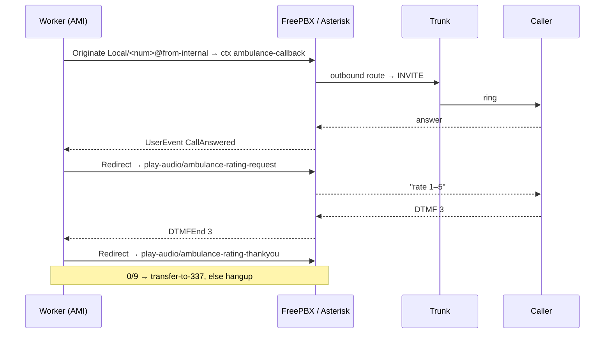

# Интеграция с FreePBX

Это **основной** способ настройки телефонии. Приложение **не** заменяет
вашу PBX — оно управляет вашим существующим FreePBX/Asterisk через AMI. Вам нужно:

1. Создать **пользователя AMI** для приложения (через GUI **или** терминал).
2. Добавить **3 пользовательских контекста dialplan**, которыми управляет приложение.
3. Убедиться, что исходящие вызовы **маршрутизируются на ваш существующий trunk**.
4. Установить **6 аудиоподсказок**.
5. Указать приложению на PBX в его `.env`.



!!! info "Где запускается worker?"
    Самая простая и надёжная топология — запускать `emergency-callback worker`
    **на самом хосте FreePBX**, чтобы AMI оставался на `127.0.0.1:5038`. Если он работает
    где-то ещё, откройте AMI для этого хоста и задайте `AMI_HOST` соответствующим образом (и тщательно
    закройте его файрволом — AMI очень мощный инструмент).

---

## Шаг 1 — Создание пользователя AMI

Приложение аутентифицируется в AMI с помощью `AMI_USERNAME` / `AMI_SECRET` из `.env`.
Используйте **либо** GUI, **либо** терминал.

=== "FreePBX GUI"

    1. Войдите в админ-интерфейс FreePBX.
    2. Перейдите в **Settings → Asterisk Manager Users**.
    3. Нажмите **Add Manager** и задайте:
        - **Manager name:** `ecb`
        - **Manager secret:** надёжный секрет (он станет `AMI_SECRET`)
        - **Deny:** `0.0.0.0/0.0.0.0`
        - **Permit:** `127.0.0.1/255.255.255.255` (или хост worker)
        - **Read permissions:** отметьте как минимум `system, call, log, verbose,
          agent, user, config, dtmf, reporting, cdr, dialplan, originate`
        - **Write permissions:** отметьте как минимум `system, call, agent, user,
          config, command, reporting, originate, message`
    4. **Submit**, затем **Apply Config** (это запишет пользователя и выполнит перезагрузку).

    !!! danger "Право чтения `dtmf` обязательно"
        Без права чтения `dtmf` приложение никогда не получит цифры с клавиатуры, поэтому
        оценки никогда не удастся собрать по телефону.

=== "Терминал"

    FreePBX подключает `manager_custom.conf` из `manager.conf` и никогда
    не перезаписывает пользовательский файл. Добавьте своего пользователя туда:

    ```bash
    sudo tee -a /etc/asterisk/manager_custom.conf >/dev/null <<'EOF'

    [ecb]
    secret = CHANGE_ME_AMI_SECRET
    deny = 0.0.0.0/0.0.0.0
    permit = 127.0.0.1/255.255.255.255
    read = system,call,log,verbose,agent,user,config,dtmf,reporting,cdr,dialplan,originate
    write = system,call,agent,user,config,command,reporting,originate,message
    EOF

    sudo fwconsole reload      # or: sudo asterisk -rx 'manager reload'
    ```

    Проверка:

    ```bash
    sudo asterisk -rx 'manager show users'      # 'ecb' must appear
    ```

Задайте соответствующие значения в `.env`:

```bash
AMI_HOST=127.0.0.1
AMI_PORT=5038
AMI_USERNAME=ecb
AMI_SECRET=CHANGE_ME_AMI_SECRET
```

---

## Шаг 2 — Добавление пользовательского dialplan

Приложению нужны **три** контекста. Поместите их в
`/etc/asterisk/extensions_custom.conf` — FreePBX **никогда** не перезаписывает этот файл.

!!! warning "НЕ переопределяйте `from-internal`"
    FreePBX уже владеет контекстом `from-internal` и использует его для применения ваших
    **Outbound Routes**. Приложение намеренно делает originate `Local/<number>@from-internal`,
    чтобы вызов проходил через обычную исходящую маршрутизацию FreePBX к вашему
    trunk. Добавляйте только три контекста ниже — никогда не добавляйте блок `[from-internal]` в
    FreePBX.

```bash
sudo tee -a /etc/asterisk/extensions_custom.conf >/dev/null <<'EOF'

; ===== Emergency Callback — control contexts (driven over AMI) =====

[ambulance-callback]
; Runs on the answered leg. Announces the answer; the app then Redirects
; this channel into play-audio.
exten => s,1,NoOp(ANSWERED CALL_ID=${CALL_ID} PHONE=${PHONE_NUMBER})
 same => n,Answer()
 same => n,UserEvent(CallAnswered,CallID: ${CALL_ID},Phone: ${PHONE_NUMBER})
 same => n,Wait(300)
 same => n,Hangup()

[play-audio]
; The app Redirects the call here with Exten = audio name
; (e.g. ambulance-rating-request). Plays it, then waits for DTMF.
exten => _.,1,NoOp(PLAY ${EXTEN} CALL_ID=${CALL_ID})
 same => n,Playback(${EXTEN})
 same => n,UserEvent(AudioPlayed,CallID: ${CALL_ID},Audio: ${EXTEN})
 same => n,WaitExten(60)
 same => n,Wait(60)
 same => n,Hangup()

[transfer-to-337]
; Operator transfer. Point this at your real operator extension/queue.
exten => s,1,NoOp(TRANSFER CALL_ID=${CALL_ID})
 same => n,Dial(Local/337@from-internal,30)
 same => n,Hangup()
EOF

sudo fwconsole reload      # or: sudo asterisk -rx 'dialplan reload'
```

Задайте цель перевода в соответствии с вашим окружением. Распространённые варианты:

- Группа звонка / очередь: `Dial(Local/777@from-internal,30)`
- Конкретный внутренний номер: `Dial(PJSIP/1005,30)`
- Любой внутренний номер, который вы уже создали для операторов — *«укажите туда»*.

Проверьте, что контексты загрузились:

```bash
sudo asterisk -rx 'dialplan show ambulance-callback'
sudo asterisk -rx 'dialplan show play-audio'
sudo asterisk -rx 'dialplan show transfer-to-337'
```

Подробное построчное объяснение: [Справочник по Dialplan](dialplan-reference.md).

---

## Шаг 3 — Исходящая маршрутизация и формат номера

Приложение **удаляет ведущий код страны `998`** и делает originate **локального
9-значного** номера в `from-internal`. Затем FreePBX сопоставляет его с вашими
**Outbound Routes** и отправляет на trunk.

Есть два способа добиться того, чтобы номер корректно достиг trunk:

=== "Использовать Outbound Route (рекомендуется)"

    В **Connectivity → Outbound Routes** убедитесь, что существует маршрут, чей **Dial
    Pattern** совпадает с 9-значным номером, который набирает приложение, и отправляет его на ваш
    trunk. Если вашему trunk нужен `998` обратно, добавьте его как prepend в шаблон
    набора, например:

    | Поле | Значение |
    |-------|-------|
    | prepend | `998` |
    | match pattern | `XXXXXXXXX` (9 цифр) |
    | trunk sequence | ваш существующий trunk |

    Это оставляет всю логику маршрутизации в FreePBX, где вы уже ею управляете.

=== "Привязать приложение к существующему внутреннему номеру/маршруту"

    Если вы уже создали внутренний номер или выделенный исходящий маршрут для этой
    цели, заставьте приложение набирать именно его. Контекст цели originate —
    `from-internal`, а набираемый токен — это очищенный локальный номер; постройте
    шаблон набора своего маршрута вокруг этого. Если вам нужен *другой* контекст
    origination целиком, эта строка сейчас зафиксирована в приложении
    (`Local/<number>@from-internal`) — см.
    [Изменение настроек](../operations/changing-things.md#change-the-country-code-prefix-or-dial-format).

!!! tip "Проверьте номер, который приложение фактически набирает"
    Следите за логом worker, когда запускаете тестовый вызов — он печатает
    `ami originated phone=<digits>`. Именно это приходит в
    `from-internal`. Постройте шаблон набора Outbound Route вокруг этого.

---

## Шаг 4 — Установка аудиоподсказок

Скопируйте шесть WAV-файлов из каталога репозитория `audios/` в каталог
звуков Asterisk (расположение по умолчанию для английского языка; скорректируйте, если ваш язык по умолчанию
отличается):

```bash
sudo cp audios/ambulance-*.wav /var/lib/asterisk/sounds/en/
# Some installs use /usr/share/asterisk/sounds/en/ — match your system:
#   sudo asterisk -rx 'core show settings' | grep -i 'data directory'
sudo chown asterisk:asterisk /var/lib/asterisk/sounds/en/ambulance-*.wav
sudo chmod 644 /var/lib/asterisk/sounds/en/ambulance-*.wav
```

Dialplan воспроизводит их по **голому имени** (без расширения), так что Asterisk выбирает
WAV автоматически. Замена или перезапись их описана в
[Аудиоподсказках](audio-prompts.md).

---

## Шаг 5 — Сквозная проверка

1. Перезагрузите всё: `sudo fwconsole reload`.
2. Запустите worker приложения (и web) — см.
   [Запуск сервисов](../operations/running-services.md).
3. Создайте тестовый callback (используйте **свой собственный** номер телефона):
   ```bash
   curl -X POST -H 'Content-Type: application/json' \
     -d '{"phone_number":"+998XXXXXXXXX"}' \
     http://127.0.0.1:8000/api/create/
   ```
4. Следите за логом worker — здоровый вызов показывает:
   ```
   ami connected → ami originated → ami call answered
   → playing audio rating_request → rating saved
   → playing audio rating_thankyou → (transfer or hangup)
   ```
5. При желании трассируйте SIP на PBX:
   ```bash
   sudo asterisk -rx 'pjsip set logger on'
   sudo tail -f /var/log/asterisk/full.log
   ```
   Работающий исходящий вызов показывает `INVITE … → 100 Trying → 183 Session Progress →
   200 OK`.

---

## Особенности Asterisk/FreePBX

Это сбои, встречающиеся на практике. Полная таблица в
[Устранении неполадок](../operations/troubleshooting.md).

| Симптом | Причина / Решение |
|---------|-------------|
| Вызов делает originate, а затем сбрасывается за миллисекунды | Исходящий `Dial` мгновенно завершился неудачей — проблема с outbound route/trunk (нет подходящего маршрута, проблема с аутентификацией или регистрацией). Трассируйте SIP. |
| `endpoint '<trunk>' was not found` | trunk/endpoint не загрузился из-за недопустимой опции PJSIP (например, `rxgain`/`txgain` на endpoint PJSIP) или из-за случайной строки не в формате `key=value` в `pjsip.conf`. |
| `Could not create dialog to invalid URI '<aor>'` | Contact AOR trunk находится в состоянии `Unavailable`, потому что qualify (SIP OPTIONS) остаётся без ответа. Установите `qualify_frequency=0` на этом AOR. |
| Нет DTMF / оценка никогда не фиксируется | У пользователя AMI отсутствует право чтения `dtmf`, либо несоответствие `dtmf_mode` у endpoint (попробуйте `auto` или `rfc4733`). |
| Аудио благодарности обрывается / странные сбросы | Старые сборки приложения блокировались на sleep; текущие сборки удаляют дубликаты DTMF (одно и то же нажатие клавиши приходит на несколько bridge-плеч) и никогда не блокируют цикл AMI. Убедитесь, что вы используете актуальную сборку. |
