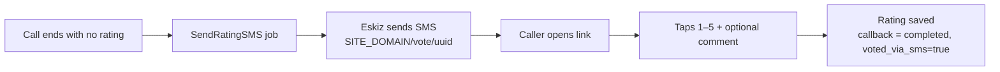

# Voting & SMS

When a call ends **without** a phone rating, the system falls back to SMS: it
texts the caller a unique link to a web page where they can rate. This page is
public (no login) and is written in **Karakalpak** (caller-facing language).

## When SMS is sent

A `SendRatingSMS` job is enqueued when a callback ends with no rating, i.e.:

- the callee never answered,
- they hung up before pressing a rating key,
- the call timed out, or
- the periodic cleanup finalized a stuck call without a rating.

The job is skipped if the callback already has a rating or an SMS was already
sent.

## What the SMS contains

A short message with a link of the form:

```
<SITE_DOMAIN>/vote/<vote_uuid>
```

`SITE_DOMAIN` comes from `.env`; `vote_uuid` is unique per callback. Set
`SITE_DOMAIN` to your real public URL or recipients get an unreachable link.

!!! info "Provider"
    SMS is sent through **Eskiz.uz**. The client logs in, caches a bearer token,
    and refreshes it automatically. If the account is out of credit the provider
    returns `Please, fill the balance` and the message is not delivered (the job
    retries). Set `ESKIZ_DRY_RUN=true` to log messages instead of sending while
    testing.

## The vote page

| URL | Purpose |
|-----|---------|
| `GET /vote/<uuid>/` | The rating page: tap 1–5 stars, optional comment, submit. |
| `POST /vote/<uuid>/submit/` | Records the rating (JSON response). CSRF-exempt. |
| `GET /vote/<uuid>/thanks/` | Thank-you page after a successful vote. |

Behavior:

- If the callback **already has a rating**, the page shows an "already rated"
  notice and will not accept another (one rating per callback).
- A submitted rating is validated (1–5, optional comment ≤ 500 chars), saved,
  and the callback is marked `completed` with `voted_via_sms = true`.
- The link works once; after voting, the callback has a rating and re-submitting
  is rejected.

## End-to-end (no-rating path)



## Operational notes

- Vote UUIDs are per-row; a **fresh database** has new UUIDs. Links generated
  against a previous database will not resolve (return 404).
- The vote endpoints are intentionally **public and CSRF-exempt** so the SMS
  link works from any phone. They only allow setting a rating once per callback.
