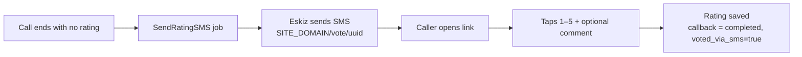

# Голосование и SMS

Когда звонок завершается **без** оценки по телефону, система переходит к
резервному варианту через SMS: абоненту отправляется уникальная ссылка на
веб-страницу, где он может поставить оценку. Эта страница публичная (без входа в
систему) и написана на **каракалпакском** языке (язык, обращённый к абоненту).

## Когда отправляется SMS

Задание `SendRatingSMS` ставится в очередь, когда обратный вызов завершается без
оценки, то есть:

- вызываемый абонент так и не ответил,
- он положил трубку до нажатия клавиши оценки,
- истекло время ожидания звонка, или
- периодическая очистка завершила зависший звонок без оценки.

Задание пропускается, если у обратного вызова уже есть оценка или SMS уже было
отправлено.

## Что содержит SMS

Короткое сообщение со ссылкой вида:

```
<SITE_DOMAIN>/vote/<vote_uuid>
```

`SITE_DOMAIN` берётся из `.env`; `vote_uuid` уникален для каждого обратного
вызова. Установите `SITE_DOMAIN` на свой реальный публичный URL, иначе получатели
получат недоступную ссылку.

!!! info "Провайдер"
    SMS отправляется через **Eskiz.uz**. Клиент выполняет вход, кэширует
    bearer-токен и обновляет его автоматически. Если на счёте закончились
    средства, провайдер возвращает `Please, fill the balance`, и сообщение не
    доставляется (задание повторяется). Установите `ESKIZ_DRY_RUN=true`, чтобы
    при тестировании записывать сообщения в лог вместо отправки.

## Страница голосования

| URL | Назначение |
|-----|---------|
| `GET /vote/<uuid>/` | Страница оценки: нажмите 1–5 звёзд, необязательный комментарий, отправьте. |
| `POST /vote/<uuid>/submit/` | Записывает оценку (ответ в формате JSON). Освобождена от CSRF. |
| `GET /vote/<uuid>/thanks/` | Страница благодарности после успешного голосования. |

Поведение:

- Если у обратного вызова **уже есть оценка**, страница показывает уведомление
  «оценка уже поставлена» и не принимает повторную (одна оценка на обратный
  вызов).
- Отправленная оценка проверяется (1–5, необязательный комментарий ≤ 500
  символов), сохраняется, а обратный вызов помечается как `completed` с
  `voted_via_sms = true`.
- Ссылка работает один раз; после голосования у обратного вызова есть оценка, и
  повторная отправка отклоняется.

## Сквозной сценарий (путь без оценки)



## Эксплуатационные заметки

- UUID голосования привязаны к строкам; в **свежей базе данных** будут новые
  UUID. Ссылки, сгенерированные на основе предыдущей базы данных, не будут
  разрешаться (вернут 404).
- Эндпоинты голосования намеренно сделаны **публичными и освобождены от CSRF**,
  чтобы ссылка из SMS работала с любого телефона. Они позволяют устанавливать
  оценку только один раз на обратный вызов.
